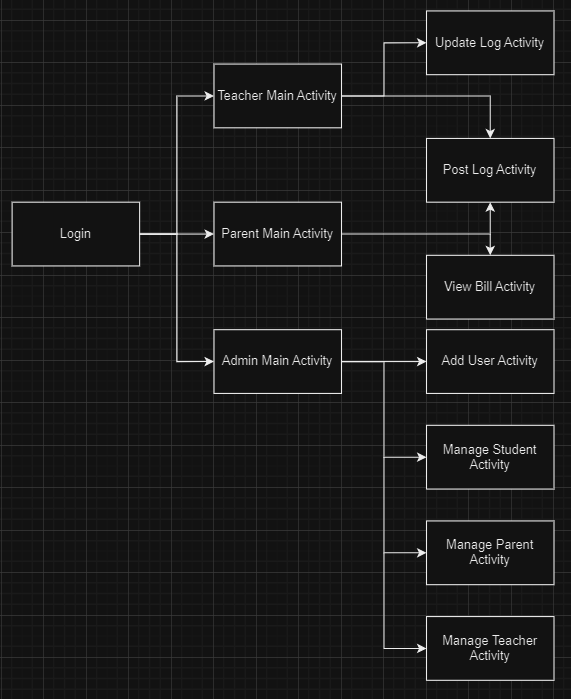
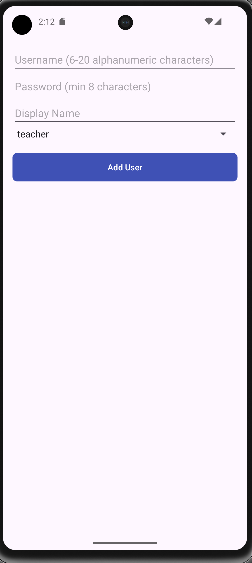
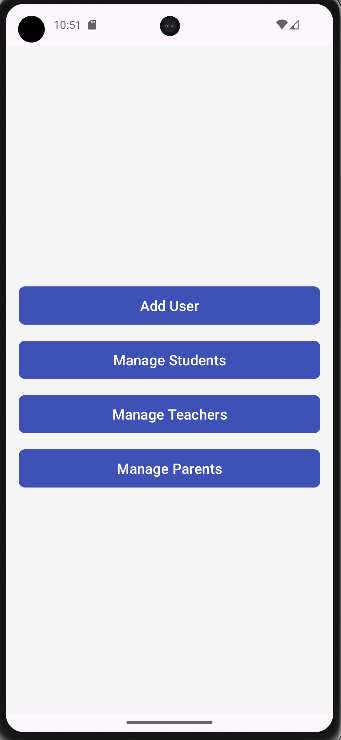
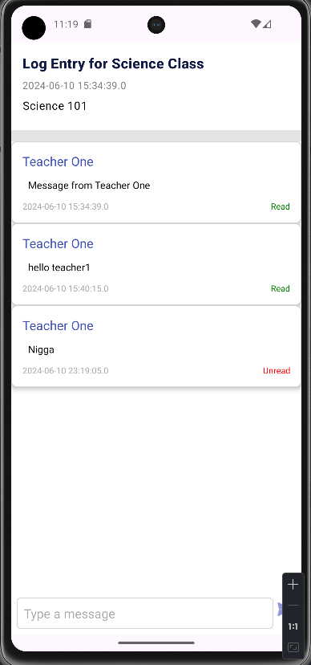
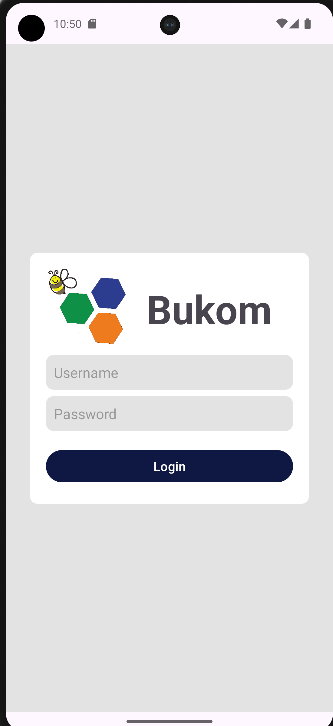
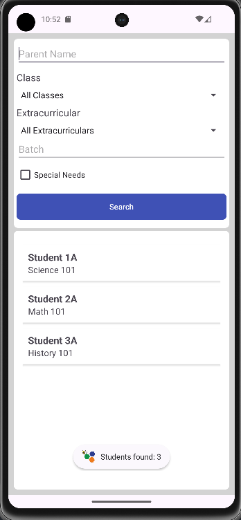
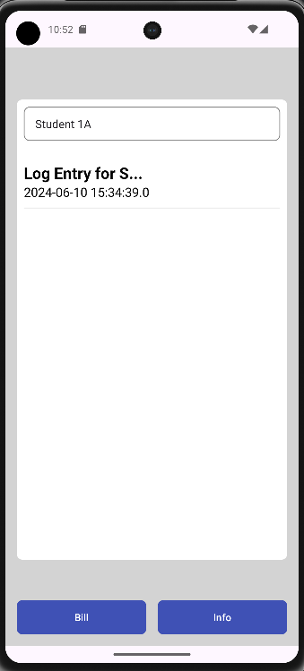
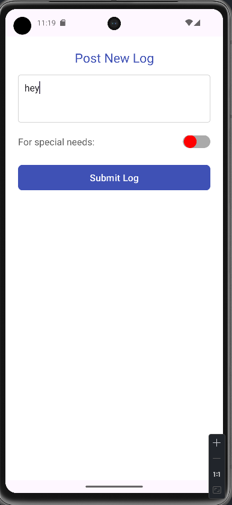
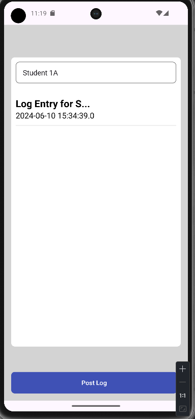
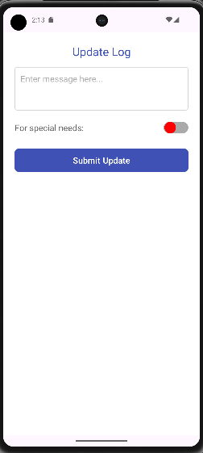

# Frontend Documentation
Frontend untuk sekolah bukom (buku kominikasi) sekolah bhinekas. Bukom sendiri berfungsi untuk menghubungkan orang tua dan guru mengenai kegiatan anak di dalam sekolah. Berikut link untuk backend
https://github.com/kamalMakarim/BE-Bhinekas
## Table of Contents
- [Introduction](#introduction)
- [Project Structure](#project-structure)
- [Activities](#activities)
  - [AddUserActivity](#adduseractivity)
  - [AdminMainActivity](#adminmainactivity)
  - [LogDetailActivity](#logdetailactivity)
  - [LoginActivity](#loginactivity)
  - [ManageParentsActivity](#manageparentsactivity)
  - [ManageStudentsActivity](#managestudentsactivity)
  - [ManageTeachersActivity](#manageteachersactivity)
  - [ParentMainActivity](#parentmainactivity)
  - [PostLogActivity](#postlogactivity)
  - [TeacherMainActivity](#teachermainactivity)
- [Adapters](#adapters)
  - [ChatAdapter](#chatadapter)
  - [StudentAdapter](#studentadapter)
- [API Services](#api-services)
  - [BaseApiService](#baseapiservice)
  - [RetrofitClient](#retrofitclient)
  - [UtilsApi](#utilsapi)
- [Models](#models)
  - [Admin](#admin)
  - [BaseResponse](#baseresponse)
  - [Chat](#chat)
  - [Extracurricular](#extracurricular)
  - [Kelas](#kelas)
  - [Log](#log)
  - [Parent](#parent)
  - [Student](#student)
  - [Teacher](#teacher)
  - [User](#user)
- [Responses](#responses)
  - [LoginRequest](#loginrequest)
  - [LoginResponse](#loginresponse)
- [Setup](#setup)
- [Usage](#usage)

## Introduction

This documentation covers the frontend of the project built using Android Studio. The project includes several activities for managing users, logs, students, teachers, and parents. The project also integrates with a backend API for data fetching and submission.

## Project Structure

The project structure is organized as follows:

- **com.example.fe_bhinekas**
  - **model**
    - **response**
      - LoginResponse
      - LoginRequest
    - Admin
    - BaseResponse
    - Chat
    - Extracurricular
    - Kelas
    - Log
    - Parent
    - Student
    - Teacher
    - User
  - **request**
    - BaseApiService
    - RetrofitClient
    - UtilsApi
  - AddUserActivity
  - AdminMainActivity
  - ChatAdapter
  - LogDetailActivity
  - LoginActivity
  - ManageParentsActivity
  - ManageStudentsActivity
  - ManageTeachersActivity
  - ParentMainActivity
  - PostLogActivity
  - StudentAdapter
  - TeacherMainActivity

## Flowchart


## Activities

### AddUserActivity
This activity allows the admin to add new users.


### AdminMainActivity
This is the main activity for admin users, providing navigation to other admin-related activities.


### LogDetailActivity
Displays details of a specific log entry.


### LoginActivity
Handles user authentication and login.


### ManageParentsActivity
Allows admin users to manage parent details.

### ManageStudentsActivity
Allows admin users to manage student details.


### ManageTeachersActivity
Allows admin users to manage teacher details.

### ParentMainActivity
Main activity for parent users.


### PostLogActivity
Allows teachers to post new log entries.


### TeacherMainActivity
Main activity for teacher users, providing navigation to other teacher-related activities.


### UpdateLogActivity
Activity to update changes for a selected log


## Adapters

### ChatAdapter
Adapter for displaying chat logs in a list or recycler view.

### StudentAdapter
Adapter for displaying student details in a recycler view.

## API Services

### BaseApiService
Defines the API endpoints and request methods used in the project.

### RetrofitClient
Sets up the Retrofit client for making API requests.

### UtilsApi
Utility class for API-related operations.

## Models

### Admin
Represents an admin user.

### BaseResponse
Generic response model for API responses.

### Chat
Represents a chat message.

### Extracurricular
Represents an extracurricular activity.

### Kelas
Represents a class.

### Log
Represents a log entry.

### Parent
Represents a parent user.

### Student
Represents a student.

### Teacher
Represents a teacher.

### User
Represents a general user.

## Responses

### LoginRequest
Model for login request payload.

### LoginResponse
Model for login response payload.

## Setup

1. Clone the repository:
   ```bash
   git clone <repository-url>
   cd <repository-directory>
   ```

2. Open the project in Android Studio.

3. Sync the project with Gradle files.

4. Ensure you have the necessary dependencies and API base URL configured in `UtilsApi`.

## Usage

Run the project on an Android device or emulator. Use the activities provided to navigate through the application features such as managing users, logs, students, teachers, and parents.

### Example Requests

- **Login User**
  ```java
  LoginRequest loginRequest = new LoginRequest("username", "password");
  mApiService.login(loginRequest).enqueue(new Callback<LoginResponse>() {
      @Override
      public void onResponse(Call<LoginResponse> call, Response<LoginResponse> response) {
          // Handle successful response
      }

      @Override
      public void onFailure(Call<LoginResponse> call, Throwable t) {
          // Handle failure
      }
  });
  ```

- **Get Students**
  ```java
  mApiService.getStudents("class_id", "parent_name", batch, specialNeeds, "extracurricular_id")
      .enqueue(new Callback<BaseResponse<List<Student>>>() {
          @Override
          public void onResponse(Call<BaseResponse<List<Student>>> call, Response<BaseResponse<List<Student>>> response) {
              // Handle successful response
          }

          @Override
          public void onFailure(Call<BaseResponse<List<Student>>> call, Throwable t) {
              // Handle failure
          }
      });
  ```

This documentation provides an overview of the project structure and usage. For detailed information on each component, refer to the respective classes and methods in the codebase.